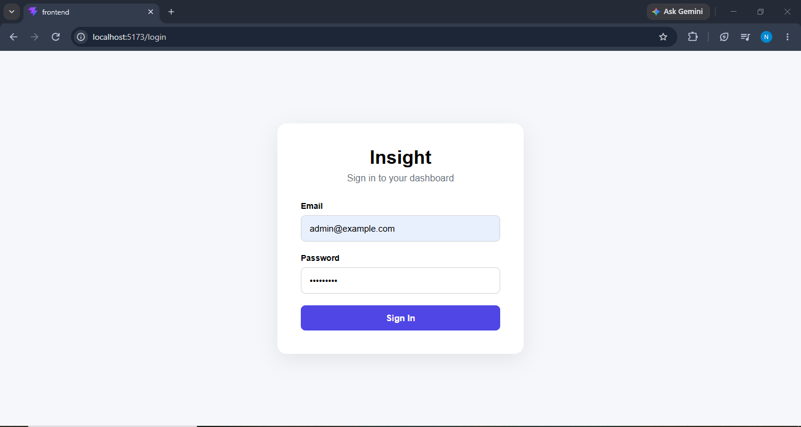
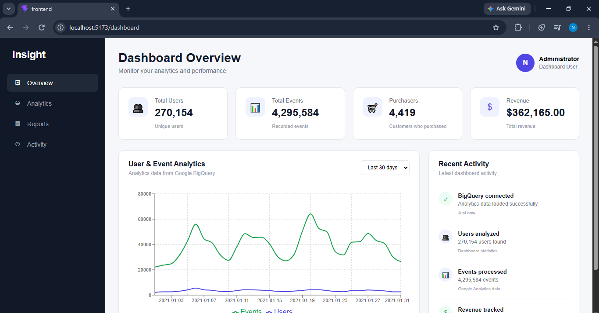

# Insight Dashboard

A full-stack analytics dashboard built with **React, Node.js, Express.js, MongoDB, JWT authentication, and Google BigQuery**.

The application provides a secure dashboard for monitoring analytics data such as users, events, purchasers, revenue, and graphical insights.

---

## Features

- JWT-based authentication
- User registration and login
- Protected dashboard routes
- Secure logout
- MongoDB database integration
- Google BigQuery integration
- BigQuery public dataset integration
- Analytics dashboard
- Total users statistics
- Total events statistics
- Purchaser statistics
- Revenue statistics
- Interactive analytics graph
- 7-day analytics
- 30-day analytics
- 90-day analytics
- Recent activity section
- Loading states
- API error handling
- Authentication error handling
- Responsive dashboard design
- Environment-based configuration
- Secure Google Cloud credential handling

---

## Technology Stack

### Frontend

- React
- Vite
- JavaScript
- CSS

### Backend

- Node.js
- Express.js
- MongoDB
- Mongoose
- JSON Web Token (JWT)
- REST API

### Cloud and Analytics

- Google BigQuery
- Google Cloud
- BigQuery Public Dataset

---

## Screenshots

### Login Page

The login page provides secure user authentication using JWT.



---

### Dashboard

The dashboard provides an overview of analytics data including total users, events, purchasers, revenue, graphical analytics, and recent activity.



---

## Project Structure

```text
insight-dashboard/
│
├── backend/
│   ├── config/
│   ├── controllers/
│   ├── middleware/
│   ├── routes/
│   ├── .env.example
│   ├── server.js
│   └── package.json
│
├── frontend/
│   ├── src/
│   │   ├── components/
│   │   ├── pages/
│   │   ├── App.jsx
│   │   ├── index.css
│   │   └── main.jsx
│   ├── package.json
│   └── ...
│
├── screenshots/
│   ├── login.png
│   └── dashboard.png
│
├── .gitignore
└── README.md
